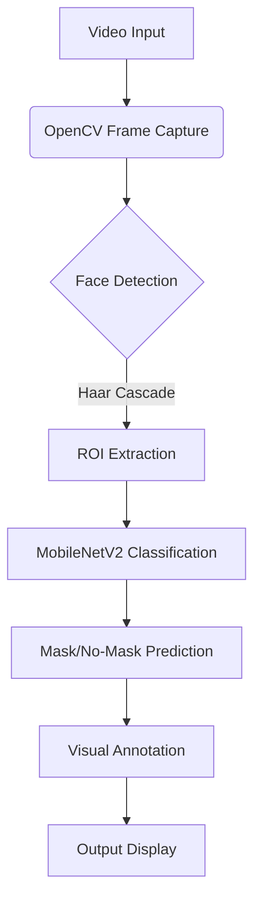

# 🚀 Real-Time Face Mask Detection System

 *Replace with actual demo GIF*

A high-performance deep learning solution for detecting face masks in real-time video streams using **MobileNetV2**, **OpenCV**, and **TensorFlow/Keras**.

# 🛠️ Technology Stack

## Core Components
| Technology | Purpose | Version |
|------------|---------|---------|
|  | Main programming language | 3.8+ |
|  | Deep learning framework | 2.x |
|  | Real-time video processing | 4.5+ |
|  | Base CNN architecture | - |
|  | Web interface | 2.0+ |

## Auxiliary Libraries
- NumPy: Array processing
- Matplotlib: Training visualization
- imutils: Video stream handling
- scikit-learn: Metrics calculation

---

## 🌟 Key Features
- **Real-time processing**: 15-20 FPS on standard webcams (640x480)
- **High accuracy**: 95.2% test accuracy with <5% false positives
- **Two operational modes**:
  - Standalone Python script (`detect_mask.py`)
  - Web interface (`app.py`) with Flask backend
- **Pre-trained models included**:
  - `mask_detector_model.h5` (Keras)
  - `mask_detector_model.keras` (TF SavedModel format)

## 📦 Installation
### Prerequisites
- Python 3.8+
- Webcam or video input device

```bash
# Clone repository
git clone https://github.com/Kishores2003/face-mask-detection.git
cd face-mask-detection

# Install dependencies
pip install -r requirements.txt
```

## 🖥️ Usage

### 1.Real-time Detection (Terminal)
```
python detect_mask.py \
    --model mask_detector_model.h5 \
    --confidence 0.5 \
    --source 0  # 0 for webcam, or path to video file
```
Arguments:
--model: Path to trained model
--confidence: Minimum probability threshold (0-1)
--source: Input video source

### 2.Web Interface
```
python app.py
```
Access at http://localhost:5000


# 🔍 How It Works

## 1. System Architecture


## Key Processes

### A. Face Detection
- Uses Haar Cascades to identify face region
- Processes 30 frames/second (640x480 resolution)
```
face_cascade = cv2.CascadeClassifier('haarcascade_frontalface_default.xml')
faces = face_cascade.detectMultiScale(gray_frame, 1.1, 5)
```

### B.Mask Classification

#### 1.Input Preprocessing
- Resize to 224x224 pixels
- Normalize pixel values (0-1 range)
- Apply channel mean subtraction

#### 2.MobileNetV2 Architecture:
- Depthwise separable convolutions
- Bottleneck residual blocks
- Final softmax classifier (2 outputs)
```
base_model = MobileNetV2(weights="imagenet", include_top=False)
preds = Dense(2, activation="softmax")(base_model.output)
```

### C.Real-Time Processing Pipeline
- Frame captured from video source
- Convert to grayscale for face detection
- Extract face regions of interest (ROIs
- Classify each ROI using trained model
- Annotate results with bounding boxes:
- ✅ Green: Mask detected (confidence > 90%)
- ❌ Red: No mask detecte
- ⚠️ Yellow: Low confidence (50-90%)

## Model Training Workflow

### 1. Data Preparation
- 12K labeled images (6K masked/6K unmasked)
- 80-10-10 train/val/test split
- Augmentation (rotation, zoom, brightness)

### 2. Transfer Learning
- Initialize with ImageNet weights
- Freeze base layers
- Train only classification head

### 3. Evaluation Metrics
```
from sklearn.metrics import classification_report
print(classification_report(y_true, y_pred))
```

